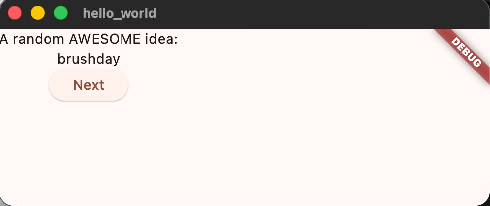

# Hello World

A new Flutter Project.


## Practicum 4
### Langkah 1

### Langkah 2


## Practicum 5
### Langkah 1

### Langkah 2

### Langkah 3
```dart
import 'package:flutter/material.dart';

void main() {
  runApp(const MyApp());
}

class MyApp extends StatelessWidget {
  const MyApp({Key? key}) : super(key: key);

  @override
  Widget build(BuildContext context) {
    return MaterialApp(
      title: 'Flutter Demo',
      theme: ThemeData(primarySwatch: Colors.red),
      home: const MyHomePage(title: 'My Increment App'),
    );
  }
}

class MyHomePage extends StatefulWidget {
  const MyHomePage({Key? key, required this.title}) : super(key: key);

  final String title;

  @override
  State<MyHomePage> createState() => _MyHomePageState();
}

class _MyHomePageState extends State<MyHomePage> {
  int _counter = 0;

  void _incrementCounter() {
    setState(() {
      _counter++;
    });
  }

  @override
  Widget build(BuildContext context) {
    return Scaffold(
      appBar: AppBar(title: Text(widget.title)),
      body: Center(
        child: Column(
          mainAxisAlignment: MainAxisAlignment.center,
          children: <Widget>[
            const Text('You have pushed the button this many times:'),
            Text(
              '$_counter',
              style: Theme.of(context).textTheme.headlineMedium,
            ),
          ],
        ),
      ),
      bottomNavigationBar: const BottomAppBar(
        child: SizedBox(height: 50.0),
      ),
      floatingActionButton: FloatingActionButton(
        onPressed: _incrementCounter,
        tooltip: 'Increment Counter',
        child: const Icon(Icons.add),
      ),
      floatingActionButtonLocation: FloatingActionButtonLocation.centerDocked,
    );
  }
}
```

### Langkah 4
```dart
import 'package:flutter/material.dart';

void main() {
  runApp(const MyApp());
}

class MyApp extends StatelessWidget {
  const MyApp({Key? key}) : super(key: key);

  @override
  Widget build(BuildContext context) {
    return const MaterialApp(home: Scaffold(body: MyLayout()));
  }
}

class MyLayout extends StatelessWidget {
  const MyLayout({Key? key}) : super(key: key);

  @override
  Widget build(BuildContext context) {
    return Padding(
      padding: const EdgeInsets.all(8.0),
      child: ElevatedButton(
        child: const Text('Show alert'),
        onPressed: () {
          showAlertDialog(context);
        },
      ),
    );
  }
}

showAlertDialog(BuildContext context) {
  // set up the button
  Widget okButton = TextButton(
    child: const Text("OK"),
    onPressed: () {
      Navigator.pop(context);
    },
  );

  // set up the AlertDialog
  AlertDialog alert = AlertDialog(
    title: const Text("My title"),
    content: const Text("This is my message."),
    actions: [okButton],
  );

  // show the dialog
  showDialog(
    context: context,
    builder: (BuildContext context) {
      return alert;
    },
  );
}
```


### Langkah 5
```dart
import 'package:flutter/material.dart';

void main() {
  runApp(const MyApp());
}

class MyApp extends StatelessWidget {
  const MyApp({Key? key}) : super(key: key);

  @override
  Widget build(BuildContext context) {
    return MaterialApp(
      title: 'Input & Selection Widget',
      theme: ThemeData(primarySwatch: Colors.blue),
      home: Scaffold(
        appBar: AppBar(
          title: const Text("Contoh TextField"),
        ),
        body: const Padding(
          padding: EdgeInsets.all(16.0),
          child: TextField(
            obscureText: false, // kalau true jadi password
            decoration: InputDecoration(
              border: OutlineInputBorder(),
              labelText: 'Nama',
            ),
          ),
        ),
      ),
    );
  }
}
```

### Langkah 6
```dart
import 'dart:async';
import 'package:flutter/material.dart';

void main() => runApp(const MyApp());

class MyApp extends StatelessWidget {
  const MyApp({Key? key}) : super(key: key);

  @override
  Widget build(BuildContext context) {
    return const MaterialApp(
      title: 'Contoh Date & Time Picker',
      home: MyHomePage(title: 'Contoh Date & Time Picker'),
    );
  }
}

class MyHomePage extends StatefulWidget {
  const MyHomePage({Key? key, required this.title}) : super(key: key);

  final String title;

  @override
  _MyHomePageState createState() => _MyHomePageState();
}

class _MyHomePageState extends State<MyHomePage> {
  DateTime selectedDate = DateTime.now();
  TimeOfDay selectedTime = TimeOfDay.now();

  Future<void> _selectDate(BuildContext context) async {
    final DateTime? picked = await showDatePicker(
      context: context,
      initialDate: selectedDate,
      firstDate: DateTime(2015, 8),
      lastDate: DateTime(2101),
    );
    if (picked != null && picked != selectedDate) {
      setState(() {
        selectedDate = picked;
      });
    }
  }

  Future<void> _selectTime(BuildContext context) async {
    final TimeOfDay? picked =
        await showTimePicker(context: context, initialTime: selectedTime);
    if (picked != null && picked != selectedTime) {
      setState(() {
        selectedTime = picked;
      });
    }
  }

  @override
  Widget build(BuildContext context) {
    return Scaffold(
      appBar: AppBar(title: Text(widget.title)),
      body: Center(
        child: Column(
          mainAxisSize: MainAxisSize.min,
          children: <Widget>[
            Text("Tanggal: ${selectedDate.toLocal()}".split(' ')[0]),
            Text("Jam: ${selectedTime.format(context)}"),
            const SizedBox(height: 20.0),
            ElevatedButton(
              onPressed: () => _selectDate(context),
              child: const Text('Pilih Tanggal'),
            ),
            ElevatedButton(
              onPressed: () => _selectTime(context),
              child: const Text('Pilih Jam'),
            ),
          ],
        ),
      ),
    );
  }
}
```


---
## Practicum Task
### 1. Done
### 2. - 
### 3. Done
### 4. Selesaikan [Codelabs: Your first Flutter app], lalu buatlah laporan praktikumnya dan push ke repository GitHub Anda!
1. Add a Text


2. Add a Button
```dart
ElevatedButton(
            onPressed: () {
              print('button pressed!');
            },
            child: Text('Next'),
          ),

```
- After i add the code above it'll show like this :

3. Make the App Prettier
- After Refactor the "Text" become "BigCard" we got a new class.
```dart
class BigCard extends StatelessWidget {
  const BigCard({
    super.key,
    required this.pair,
  });

  final WordPair pair;

  @override
  Widget build(BuildContext context) {
    return Text(pair.asLowerCase);
  }
}
```
```dart
    return Card(
      child: Padding(
        padding: const EdgeInsets.all(20),
        child: Text(pair.asLowerCase),
      ),
    );
```
- After i add the code above itll show Box with text "Brushday" in it.

- We can change the color tho by adding this code.
```dart
@override
  Widget build(BuildContext context) {
    final theme = Theme.of(context);       // ← Add this.

    return Card(
      color: theme.colorScheme.primary,    // ← And also this.
      child: Padding(
        padding: const EdgeInsets.all(20),
        child: Text(pair.asLowerCase),
      ),
    );
  }
```

The app displays a colored card with styled text. This shows how you can use Flutter’s theme to change the card’s color and text style for a more attractive appearance.


A button is added below the card. This button allows users to interact with the app, such as generating a new word when pressed.

The layout is improved by centering the card and button vertically and horizontally, making the UI look cleaner and more balanced.


Both “Like” and “Next” buttons are shown side by side. Users can either favorite the current word or generate a new one, enhancing interactivity.


The Home page is selected in the navigation rail. The main area displays the word card and action buttons, as before.


The Favorites page is selected. The app now shows a list of all word pairs that the user has marked as favorites.


The final version of the app. It features a styled navigation rail, a highlighted Home icon, and a well-designed main content area, providing a polished and user-friendly experience.
